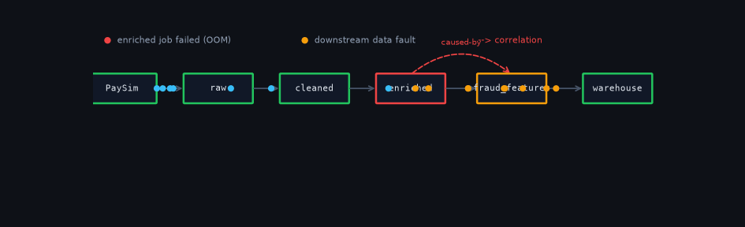
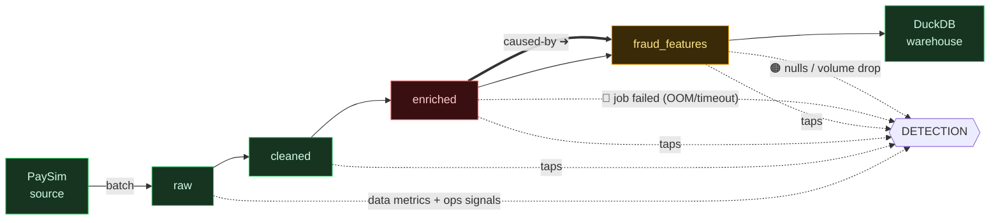
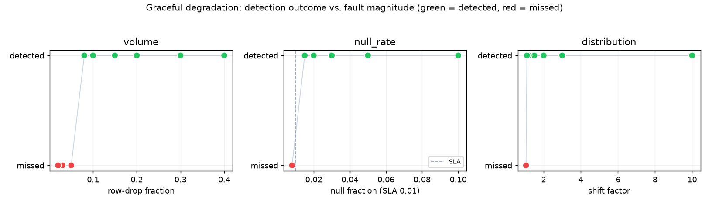
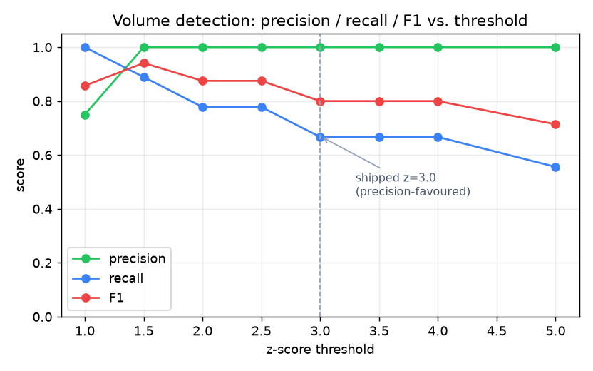

# Sentinel

[](https://github.com/Lokeshloki1219/sentinel-data-observability/actions/workflows/tests.yml)
[](LICENSE)
[](pyproject.toml)

**An LLM-powered agentic data-pipeline observability system.**

Sentinel sits alongside a running data pipeline and watches **two signal streams together** —
the **data** produced by each run and the **operational state** of the pipeline jobs. It
detects anomalies without hand-written rules, uses an LLM to **correlate symptoms with
causes** into a structured incident report, and — for a small set of safe, reversible
actions — executes a fix **only after explicit human approval**. Every incident, decision,
and outcome is remembered, so diagnoses improve over time.

> **Not an AI code assistant.** Cursor/Copilot help you *write code in an editor*. Sentinel
> watches *running data* and reacts to *live data problems* — silent data-quality failures
> that pass infrastructure monitoring because the job exits cleanly but the data is wrong.

**Operating loop:** `Observe → Reason → Propose → Approve → Act → Remember`, with continuous
watching of subsequent runs for auto-resolution. See [docs/architecture.md](docs/architecture.md)
and the [design write-up](docs/writeup.md).

## Demo



> _The **🔀 Pipeline Flow** tab renders this **live** in the browser: a batch streams through
> `raw → cleaned → enriched → fraud_features`; the broken stage glows (🟠 data error / 🔴 pipeline
> error) and a dashed "caused-by" arc links a job failure to the downstream data fault. Try it with
> `python scripts/seed_demo.py --fresh` → `streamlit run dashboard/app.py`._

## Architecture — six layers

| # | Layer | Module | Fidelity |
|---|-------|--------|----------|
| 1 | Intent | `intent/` | Light config — per-dataset SLAs/expectations |
| 2 | Observability | `observability/` | **Full (core)** — two-stream metrics + detection |
| 3 | Reasoning | `reasoning/` | **Full (core)** — LLM root-cause correlation |
| 4 | Action | `action/` | Constrained — 2 reversible, gated actions |
| 5 | Memory | `memory/` | **Full (differentiator)** — RAG over incident history |
| 6 | Governance | `governance/` | Light–medium — risk gate, suppression, audit, auto-resolve |

`orchestrator.py` wires these into the full control loop (Spec §10).

## What it detects

Sentinel watches **two signal streams per stage** — the data produced (🟠 *data errors*) and
the job that produced it (🔴 *pipeline errors*) — and **correlates** them.

| Stream | Check | Catches | How |
|---|---|---|---|
| 🟠 Data | **Freshness** | late / stale data | `freshness_minutes` > SLA |
| 🟠 Data | **Volume** | too few / too many rows | rolling z‑score ≥ 3 or outside bounds |
| 🟠 Data | **Null‑rate** | completeness spikes | per‑column threshold or z ≥ 3 |
| 🟠 Data | **Schema** | column added / removed / retyped | schema‑hash diff |
| 🟠 Data | **Distribution** | value drift | PSI ≥ 0.2 / median z ≥ 3 |
| 🟠 Data | **Validity / range** | impossible values (negatives, sensor spikes) | min/max vs configured range |
| 🟠 Data | **Uniqueness** | duplicate rows / non‑idempotent retries | duplicate‑rate on a key |
| 🔴 Ops | **OOM** | out‑of‑memory kill | job failed, exit code 137 |
| 🔴 Ops | **Timeout** | hung / over‑SLA job | exit 124 or duration > SLA |
| 🔴 Ops | **Slow / compute** | compute pressure, skew | duration z‑score spike |
| 🔴 Ops | **Retry storm** | API throttling (429), instability | retries over ceiling |
| 🔴 Ops | **Job failed / skipped** | upstream failure | orchestrator status |

Operational signals are read from the job's `status / duration / retries / exit_code` — exactly
how a real orchestrator (Prefect / Airflow / Spark) exposes them. (Validity, uniqueness, and the
operational checks **extend** the spec's normative five — additively and opt-in via Intent.)

**The differentiator — correlation:** when an upstream job failure *causes* a downstream data
fault, Sentinel flags both and the LLM attributes `caused_by = upstream_job` / `infrastructure`,
drawing the "caused‑by" link in the live flow graph.

**Out of scope** (documented, not built): streaming‑runtime failures (backpressure, poison
pills, rebalance storms), orchestration‑*engine* problems (circular DAGs), and subtle in‑range
hardware corruption. Sentinel complements crash‑monitoring tools (Datadog / PagerDuty) — it
catches *silent data* failures and correlates them with job state, rather than re‑alerting
infrastructure crashes.

## Live pipeline-flow animation

The dashboard's **🔀 Pipeline Flow** tab renders the real data architecture as a live animated
canvas: a batch streams through the stages, the broken stage glows, and the two error classes
are colour‑coded with the cross‑signal correlation drawn in. Click **▶ Run a batch** (optionally
injecting any fault) to watch detection happen in‑flight.



🟢 healthy · 🟠 data error · 🔴 pipeline error · ➜ caused‑by correlation. See
[docs/architecture.md](docs/architecture.md) for the full diagrams.

## Quick start

```bash
# 1. Create the environment and install (Python 3.11)
python -m venv .venv
.venv\Scripts\activate
pip install -e .            # add ".[gpu]" for CUDA-accelerated embeddings

# 2. (optional) configure — only needed for LLM reports / Slack
copy .env.example .env      # set ANTHROPIC_API_KEY and/or SLACK_WEBHOOK_URL

# 3. Seed the live dashboard DB (no API key needed)
python scripts/seed_demo.py --fresh

# 4. Launch the dashboard
streamlit run dashboard/app.py
```

The dashboard shows the **health timeline**, an **incident feed** with the report and
**Approve / Reject (reason-coded) / Modify / Snooze** controls plus an action preview, and
the **audit log**.

## Evaluation

```bash
python -m evaluation.run_experiments   # labelled faults: matched P/R/F1 + FP trend (no key)
python -m evaluation.graduated         # honest degradation: threshold sweep + suppression loop
python -m evaluation.run_experiments --use-llm   # + attribution, report quality, memory ablation
```

**Labelled faults** (`run_experiments`, no-LLM): on the 11 injected faults, detection scores
**1.00 / 1.00 / 1.00** with **0** false positives — but these are *deliberately obvious*
(50% row-drops, 10× shifts), and a run only counts as a true positive when the **matching
check-type** fires (not just any anomaly). So the honest picture is the graduated study:

**Graduated degradation** (`evaluation.graduated` → `evaluation.plots`) — same detector, faults
injected at a range of magnitudes against a baseline with realistic ~2% volume variance.
Detection **degrades gracefully** as faults get subtler (green = detected, red = missed);
per-family recall: volume **0.67**, null **0.83**, distribution **0.86**:



The precision/recall/F1 **vs. z-threshold** curve makes the operating point a visible trade-off:



> **Why ship z = 3.0 when F1 peaks at z = 1.5?** By choice, not oversight: at z = 3 precision
> stays **1.00** (recall 0.67), so every alert is real — favouring precision over recall to avoid
> **alert fatigue**, consistent with the suggest-first philosophy. Lowering to z = 1.5 buys recall
> (0.89) but would start surfacing marginal blips.

**Learning loop** (real, no-LLM): a recurring benign +25% volume surge trips the volume check
every run; after one `not_a_problem` creates a `SuppressionRule` via the governance path, the
false-positive rate for that pattern drops **1.0 → 0.0** (`fp_trend = [1,0,0,0,0,0]`).

**LLM reasoning** (`run_experiments --use-llm`, Sonnet — `data/eval_results_llm.json`):

| Metric | Result |
|---|---|
| **Root-cause attribution** (overall) | **0.82** — `caused_by` matches ground truth |
| **Attribution on operational-cause faults** | **1.00** — correctly blames the upstream job / infra, not the data |
| **Report-quality rubric** (avg) | **0.77** (root-cause 0.82 · severity 1.00 · confidence-calibration 0.82 · action-appropriateness 0.36) |
| **Memory-ablation lift** | **+0.05** (0.77 with-memory vs 0.72 without) — retrieval helps, mainly via better action selection |

Honest reads: operational-cause **attribution is the standout (1.00)** — the cross-signal RCA
works. Action-appropriateness (0.36) is the weakest link (the model often proposes `manual`
where the rubric wants a concrete action), and the memory lift is **modest but positive** on
this small corpus.

## Tests

```bash
pytest -q
```

Covers the end-to-end control loop, the action/governance round-trip
(quarantine + undo, suppression, gating, debounce), and fast unit tests for the core
primitives (schema hash, z-score, PSI, severity mapping, gate policy).

## Dataset

The pipeline generates **synthetic PaySim** mobile-money transactions in
[`pipeline/ingest.py`](pipeline/ingest.py) (deterministic per `day`) — no download required.
Stages monitored: `raw_transactions → cleaned_typed → enriched → fraud_scoring_features`.

## Environment variables

| Variable | Required for | Default |
|----------|--------------|---------|
| `ANTHROPIC_API_KEY` | LLM reasoning (`--use-llm`) | — |
| `SLACK_WEBHOOK_URL` | Slack routing of high/critical incidents | disabled |
| `SENTINEL_DB_URL` | warehouse location | `data/sentinel.duckdb` |
| `SENTINEL_ENV` | `dev` / `eval` | `dev` |

## Docs

- [docs/architecture.md](docs/architecture.md) — Mermaid diagrams (six layers + operating loop)
- [docs/writeup.md](docs/writeup.md) — design rationale, evaluation results, documented failure cases, trade-offs
