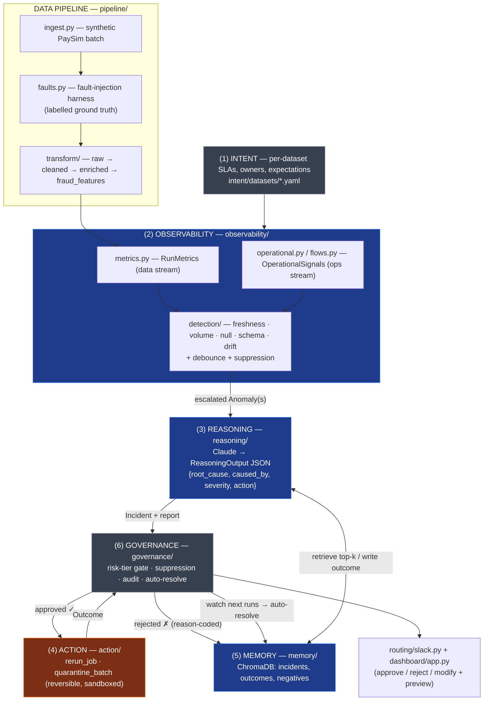
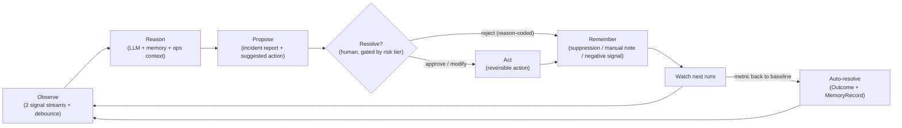
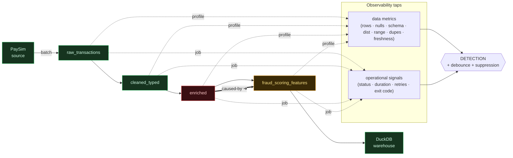

# Sentinel — Architecture

> These diagrams use [Mermaid](https://mermaid.js.org/), which GitHub renders natively.
> To produce the `architecture.png` named in the spec, open this file on GitHub (or in
> VS Code with a Mermaid extension) and export the rendered diagram.

## Six-layer reference architecture + data flow

`orchestrator.py::process_run` is the glue that runs this whole cycle for one completed
pipeline run (Spec §10): detect-before-persist → group → retrieve → reason → create
incident → audit → gate → route → auto-resolve.

## The operating loop

## Pipeline data architecture (the live flow animation)

The dashboard's **🔀 Pipeline Flow** tab animates this architecture: dense particles stream
through the pipes, each stage glows by health, the two observability streams fan into the
Detection engine, and an operational failure draws a dashed **caused‑by** link to the data
error it produced.

**Colour key:** 🟢 healthy · 🟠 data error (amber: a data check fired) · 🔴 pipeline error
(red: the job failed/slowed/retried — OOM, timeout, compute, 429). The example shows the
flagship case: `enriched` fails (🔴) → `fraud_scoring_features` data collapses (🟠), linked by
the **caused‑by** arc. Drive it live with `python scripts/seed_demo.py` then
`streamlit run dashboard/app.py`.

## Fidelity at a glance

| # | Layer | Fidelity | Module |
|---|-------|----------|--------|
| 1 | Intent | Light (config) | `intent/` |
| 2 | Observability | **Full (core)** | `observability/` |
| 3 | Reasoning | **Full (core)** | `reasoning/` |
| 4 | Action | Constrained (2 reversible, gated) | `action/` |
| 5 | Memory | **Full (differentiator)** | `memory/` |
| 6 | Governance | Light–medium | `governance/` |
