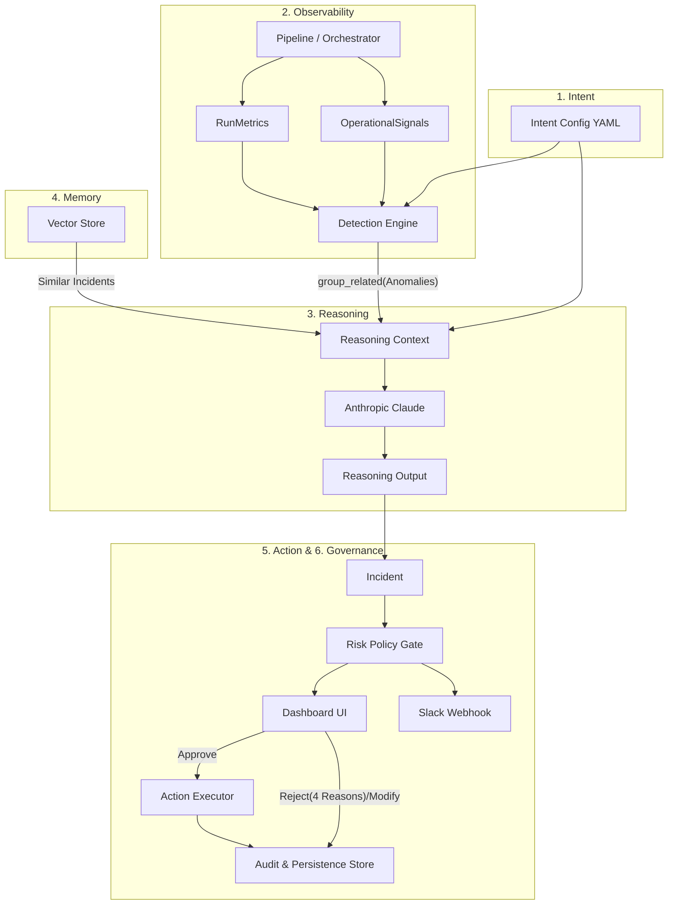

# Sentinel Implementation Plan (Detailed)

This document provides a highly granular, file-by-file breakdown of the implementation strategy for the Sentinel agentic data-pipeline observability system.

## User Review Required

> [!IMPORTANT]
> Please review the detailed architectural plan below. If the file-by-file strategy looks correct, we will begin execution.

## Open Questions

> [!WARNING]
> To proceed, I need final confirmation on:
> 1. **Data Warehouse**: Proceeding with DuckDB locally for rapid development.
> 2. **Orchestrator**: Proceeding with a custom Python scheduler / loop to generate `OperationalSignals` and run the synthetic pipeline, to keep complexity low.
> 3. **Vector Store**: Proceeding with ChromaDB for Memory storage.
> 4. **Project Root**: `s:\Sentinel`. *I will initialize a git repo here to provide the `code_version` to the reasoning context.*

## Proposed Architecture and Flow

## Detailed Module Breakdown & Control Flow

### Core Data Models (`schemas.py`)
Centralized Pydantic schemas: `IntentConfig`, `RunMetrics`, `OperationalSignals`, `Anomaly`, `ReasoningContext`, `ReasoningOutput`, `Incident`, `ActionDefinition`, `Resolution`, `Outcome`, `SuppressionRule`, `MemoryRecord`, `AuditEntry`.

### 1. The Pipeline & Fault Harness (`pipeline/`)
- **`pipeline/ingest.py` & `pipeline/transform/`**: A mock script utilizing Pandas/DuckDB to generate batches of PaySim transactions.
- **`pipeline/faults.py`**: A harness that injects row-drops, schema changes, distribution shifts, and operational task failures.

### 2. Intent & Observability (`intent/`, `observability/`)
- **`intent/parser.py`**: Loads `intent/datasets/<dataset>.yaml`.
- **`observability/store.py`**: DuckDB wrapper. Contains fully spec-compliant table definitions for `metrics`, `ops_signals`, `incidents`, `audit`, **AND** `suppression_rules`, `resolutions`, and `outcomes`. This ensures persistence for auto-resolution across runs.
- **`observability/metrics.py`**: Computes `RunMetrics` (row counts, null rates, etc).
- **`observability/detection/`**:
  - `engine.py`: Runs baseline comparisons (Z-score, PSI) and rule checks. **Cost-Control / Debounce**: Implements logic to drop suppressed items, enforce 2-run debounce for low/medium severity, and deduplicate to prevent runaway LLM costs.

### 3. Reasoning Engine (`reasoning/`)
- **`reasoning/context.py`**: Implements **`group_related()`** to bundle multiple anomalies into a single incident context. Fetches `code_version` using local git SHA. Packages everything into `ReasoningContext`.
- **`reasoning/prompts.py`**: Strict system prompt constraints.
- **`reasoning/reporter.py`**: Calls `claude-sonnet-4-6`. Parses outputs with fallback logic (`report_invalid`).

### 4. Memory Layer (`memory/`)
- **`memory/store.py` & `embed.py`**: ChromaDB collection initialization and text summarization.
- **`memory/retrieve.py`**: Fetches top-k similar incidents. Critical feature: handles **negative retrieval signals** attached to incidents that were marked `wrong_diagnosis` so the LLM learns what *not* to do.

### 5. Action, Governance, Routing (`action/`, `governance/`, `routing/`)
- **`routing/slack.py`**: Webhook payload generator routing `high/critical` incidents to Slack.
- **`action/registry.py`**: Defines static actions (`rerun_job`, `quarantine_batch`, etc.) and reversibility.
- **`action/executor.py`**: Executes approved actions and explicitly implements **`undo`** mechanisms (e.g., executing `undo` for a quarantine implies shifting rows back out of the `quarantine` table).
- **`governance/approval.py`**: Implements 4-way reason routing:
  - `not_a_problem` → Trigger `suppression.py` to create `SuppressionRule`.
  - `will_fix_manually` → Mark `acknowledged_manual` and store note to memory.
  - `wrong_diagnosis` → Keep open, attach negative retrieval signal to memory.
  - `defer` → Mark `snoozed`.
- **`governance/resolution.py`**: Watches open incidents; if future batches pass checks for K runs, it sets `Outcome` properly.

### 6. The Web UI (`dashboard/`)
- **`dashboard/app.py`**: Streamlit health timeline, incident feed, and Approve/Reject controls implementing the 4-way routing.

### 7. Evaluation & Verification (`evaluation/`, `tests/`)
- `tests/test_*.py`: Pytest suite for debounce, debounce, context grouping.
- `evaluation/detection_metrics.py`: Computes F1, precision/recall against ground-truth fault injections.
- `evaluation/attribution.py`: Computes correct LLM identification of upstream operational causes.
- `evaluation/report_rubric.py`: Quality checks/LLM-as-a-judge for reasoning outputs.
- `evaluation/memory_ablation.py`: Validates performance delta with Memory retrieved vs Memory disabled.
